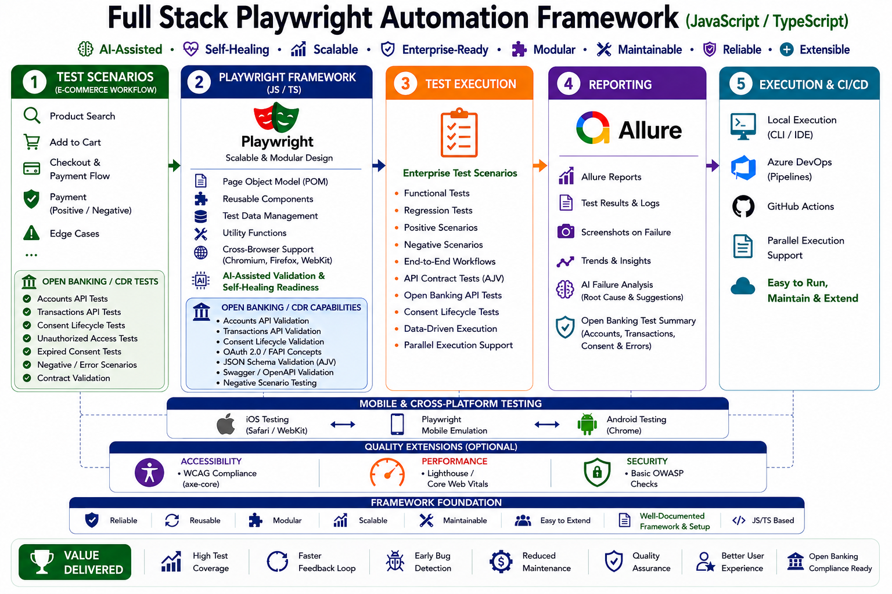
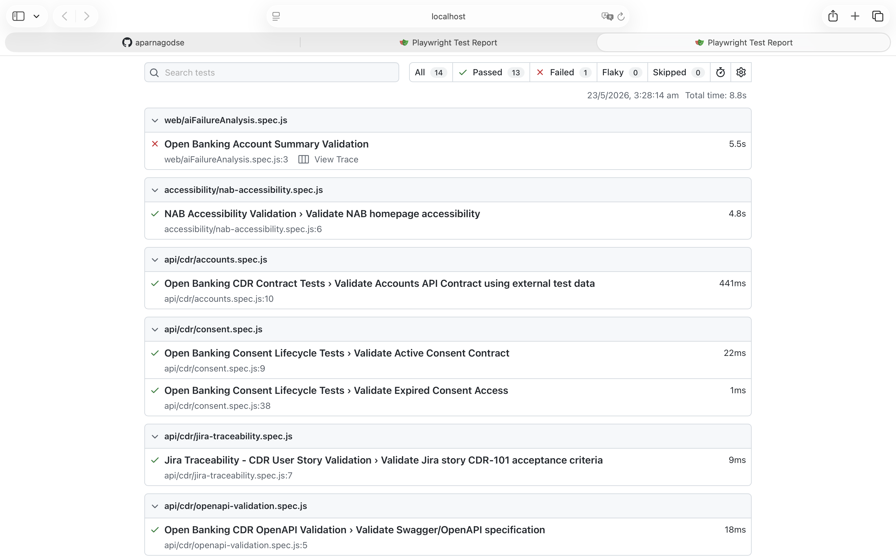
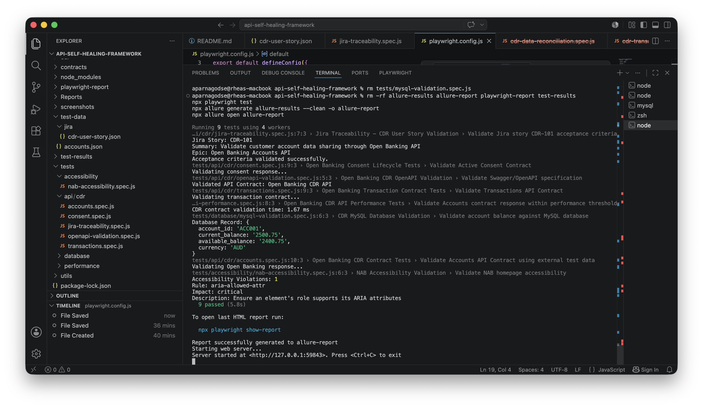
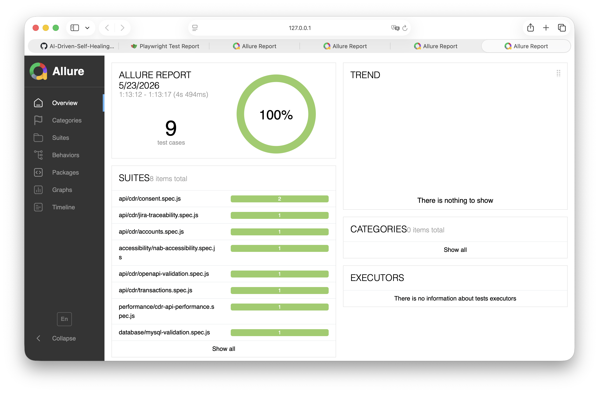
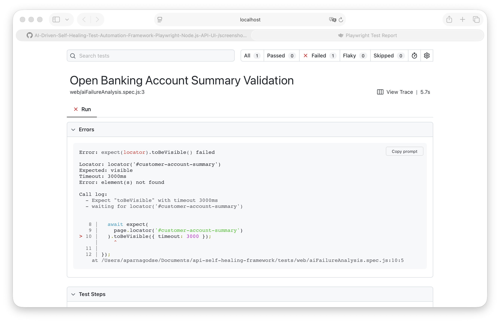
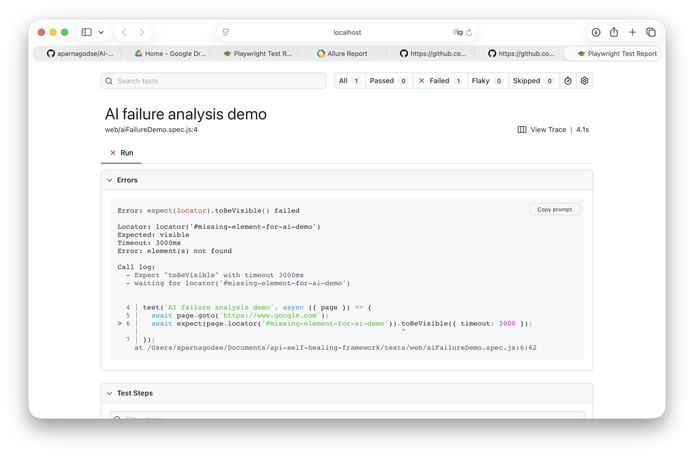

# Open Banking QE Automation Framework
AI-Driven Self-Healing Playwright Framework for Enterprise Banking, API, Accessibility and Contract Testing

This repository demonstrates a modern enterprise Quality Engineering framework built using Playwright, JavaScript, and enterprise automation testing practices.

The framework has been extended to support Open Banking / Consumer Data Right (CDR) validation scenarios including API automation, contract validation, backend validation, performance validation, accessibility testing, and enterprise reporting.

# 🏗️ Framework Architecture



---

# 📂 Framework Structure

```text
contracts/
├── cdr/
│   ├── account.schema.json
│   ├── transaction.schema.json
│   ├── consent.schema.json
│   └── openbanking-api.yaml

tests/
├── api/
│   └── cdr/
│       ├── accounts.spec.js
│       ├── transactions.spec.js
│       ├── consent.spec.js
│       ├── openapi-validation.spec.js
│       └── jira-traceability.spec.js
│
├── database/
│   └── mysql-validation.spec.js
│
├── performance/
│   └── cdr-api-performance.spec.js
│
├── accessibility/
│   └── nab-accessibility.spec.js

test-data/
├── accounts.json
└── jira/
    └── cdr-user-story.json

utils/
└── schemaValidator.js

screenshots/
Reports/
allure-report/
playwright-report/
```
---

# 🚀 Enterprise Open Banking / CDR QE Framework

This framework demonstrates an enterprise Quality Engineering approach for Open Banking / Consumer Data Right (CDR) validation using Playwright and modern enterprise testing practices.

The framework has been extended beyond traditional UI automation to support:

## ✅ API & Open Banking Validation
- Open Banking / CDR Accounts API validation
- Transactions API validation
- Consent lifecycle validation
- Negative API scenarios
- REST / JSON API testing

## ✅ Contract & API Governance Validation
- AJV JSON schema contract validation
- Swagger / OpenAPI specification validation
- Runtime response validation
- API contract assurance

## ✅ Backend & Data Validation
- MySQL backend validation
- Source-to-target reconciliation testing
- Database-to-API consistency checks
- Financial data integrity validation
- SQL query validation

## ✅ Performance Validation
- API response threshold validation
- Lightweight SLA validation
- Extensible toward Gatling / JMeter / k6 integration

## ✅ Accessibility Validation
Accessibility validation is integrated using axe-core with Playwright.

Coverage includes:

- WCAG-focused accessibility validation
- Accessibility audit execution
- Accessibility evidence generation
- Automated accessibility scanning patterns

## ✅ Enterprise Reporting & Traceability
- Allure enterprise reporting
- Playwright HTML reporting
- Execution traceability
- Representative Jira traceability integration pattern
- Externalised reusable test datasets

## ✅ Scalable QE Architecture
- Modular framework design
- Reusable validation utilities
- Externalised test data management
- CI/CD-ready execution model
- Enterprise-quality reporting structure

---

# 🎯 Enterprise QE Focus Areas Demonstrated

This framework demonstrates representative enterprise Quality Engineering patterns commonly used across:

- Open Banking / Consumer Data Right (CDR)
- Banking & Payments platforms
- API-driven architectures
- Data reconciliation programmes
- Enterprise automation transformation initiatives
- Backend and integration testing
- Regulatory and compliance-driven testing

---

# 🧪 Enterprise Validation Layers

The framework demonstrates multiple layers of enterprise-grade validation commonly used across Open Banking, API-driven, and regulated enterprise platforms.

## 1️⃣ Swagger / OpenAPI Validation

Purpose:
- Validate API specification governance
- Validate endpoint definitions
- Validate OpenAPI contract structure
- Ensure API governance compliance

Validation Source:
- `contracts/cdr/openbanking-api.yaml`

Technology:
- swagger-parser

---

## 2️⃣ Schema Validation

Purpose:
- Validate runtime API payload structure
- Validate mandatory fields
- Validate payload data types
- Validate schema compliance

Validation Source:
- `contracts/cdr/account.schema.json`

Technology:
- AJV JSON schema validation

---

## 3️⃣ Response Validation

Purpose:
- Validate business response correctness
- Validate expected account values
- Validate business assertions
- Validate product categories and account data

Validation Source:
- `test-data/accounts.json`

Validation Type:
- Expected business data vs actual API response

---

## 4️⃣ Backend / Database Validation

Purpose:
- Validate backend reconciliation
- Validate database-to-API consistency
- Validate financial data integrity
- Validate source-to-target consistency

Validation Source:
- MySQL database

Validation Type:
- Database values vs API response validation

---

# ⚠️ Note

This framework is a representative enterprise QE accelerator and demonstration platform designed to showcase scalable automation, contract validation, backend validation, reporting, and Open Banking testing concepts.

---

## 📸 Demo Screenshots

### ✅ Playwright Test Report

This report shows the overall execution status of automated tests, including pass/fail results, execution time, and detailed step logs. It provides quick visibility into test health and regression outcomes.



---

### ⚡ Test Execution + Accessibility + Performance

This combined report demonstrates how functional testing is integrated with accessibility (WCAG checks) and performance (Lighthouse scores), giving a full quality view in a single execution.



---

## 📊 Allure Report

### Dashboard Overview

The Allure dashboard provides a visual summary of test execution, including trends, pass/fail distribution, and execution insights, making it easier for stakeholders to understand test outcomes.



---
### Failure Analysis

This view highlights failed tests with detailed debugging information such as error messages, screenshots, logs, and execution traces, helping quickly identify root causes.



---

## 🤖 AI Failure Analysis (Allure Integration)

The framework demonstrates a representative AI-assisted failure analysis concept that automatically detects test failures, categorises the likely root cause, and provides actionable recommendations directly inside the Allure report.

In the example below:

- The failure is identified as a **Locator Issue**
- The AI engine analyses the error message and classifies the root cause
- A suggested fix is generated to help resolve the issue quickly
- A confidence score indicates the reliability of the recommendation

This helps reduce debugging time, improves test stability, and supports faster root cause analysis — aligning with modern AI-assisted quality engineering practices.



---

## 🚀 Key Features

- End-to-end automation using Playwright (API + UI)
- AI-assisted self-healing concepts for flaky test recovery
- Reusable API client layer for scalable testing
- Page Object Model (POM) for maintainable UI tests
- Accessibility testing using axe-core
- Performance validation using Lighthouse
- Mobile testing structure for responsive scenarios
- CI/CD integration using GitHub Actions
- Allure enterprise reporting with failure analysis support
- Open Banking / Consumer Data Right (CDR) API validation
- Contract testing using AJV JSON schema validation
- Swagger/OpenAPI governance validation
- Consent lifecycle validation
- Performance-aware API testing
- Backend database validation using MySQL
- Externalised reusable test datasets
- Representative Jira traceability integration pattern

# 🏦 Open Banking / Consumer Data Right (CDR) API Testing

The framework has been extended to support enterprise-grade Open Banking / Consumer Data Right (CDR) API validation scenarios aligned to modern banking and fintech ecosystems.

Implemented coverage includes:

- Accounts API validation
- Transactions API validation
- Consent lifecycle validation
- Unauthorized access validation
- Negative API scenarios
- Runtime contract/schema validation
- Swagger/OpenAPI governance validation
- Performance-aware API validation

---

## ✅ Open Banking Test Coverage

### Accounts API Validation

Implemented validation for:

- Account retrieval APIs
- Mandatory field validation
- Product category validation
- Schema compliance checks

### Transactions API Validation

Implemented validation for:

- Transaction payload validation
- Currency validation
- Transaction structure validation
- Response schema validation

### Consent Lifecycle Validation

Implemented Open Banking consent scenarios including:

- Active consent validation
- Expired consent validation
- Unauthorized access validation
- Negative consent scenarios

---

# ✅ Contract Testing & Schema Validation

The framework includes enterprise-style API contract testing using AJV JSON schema validation.

Purpose:

- Validate runtime API payloads
- Ensure API schema compliance
- Prevent downstream integration failures
- Validate mandatory fields and data types

Validated APIs:

- Accounts API
- Transactions API
- Consent API

Validation coverage includes:

- Mandatory field validation
- Data type validation
- Payload structure validation
- Runtime contract assurance
- Negative schema validation

---

# ✅ Swagger / OpenAPI Validation

Integrated Swagger/OpenAPI validation for API governance and contract specification validation.

Implemented using:

- OpenAPI 3.0
- swagger-parser

Validation coverage:

- OpenAPI specification validation
- Endpoint validation
- API path verification
- Response definition validation
- API governance checks

This provides:

- API contract governance
- API specification assurance
- Enterprise integration validation

---

# ✅ Backend & Database Validation

The framework includes representative backend validation and reconciliation testing using MySQL.

Implemented validation includes:

- Database connectivity validation
- Source-to-target reconciliation
- Database-to-API consistency checks
- Financial balance validation
- SQL query execution validation

This demonstrates enterprise data validation concepts commonly used across banking and Open Banking programmes.

---

# ⚡ Performance Validation

Implemented lightweight API performance validation using Playwright performance timing checks.

Coverage includes:

- Contract validation timing checks
- SLA threshold validation
- Response timing verification

Framework designed for future integration with:

- Gatling
- JMeter
- k6

for:
- Load testing
- Stress testing
- Spike testing
- Endurance testing


## ▶️ Demo Video

👉 https://drive.google.com/file/d/1A1DT-3QVswHYtVJ5rDmKKXfzw5PaI7M5/view

---

## ⚙️ How to Run

```bash
npm install
npx playwright install
npx playwright test
```

---

## 📊 Reporting

```bash
npx playwright show-report
npx allure generate allure-results --clean -o allure-report
npx allure open allure-report
```

---

## 💡 What Makes This Framework Different?

- Enterprise-focused Quality Engineering approach
- Open Banking / CDR validation capability
- AI-assisted automation concepts
- Enterprise reporting and traceability
- Backend reconciliation and data validation
- Enterprise quality validation across API, UI, Accessibility, Performance, and Backend layers

---

## 🎯 Purpose

This framework demonstrates how enterprise Quality Engineering practices can combine:

- API automation
- Contract validation
- OpenAPI governance
- Backend reconciliation
- Accessibility validation
- Performance validation
- Enterprise reporting
- Scalable automation architecture

---

## 👩‍💻 Author

Aparna Godse  

Quality Engineering Lead | Test Architecture & Automation Lead

Enterprise QE | Open Banking | API Testing | Accessibility | Data Validation | Performance Testing
